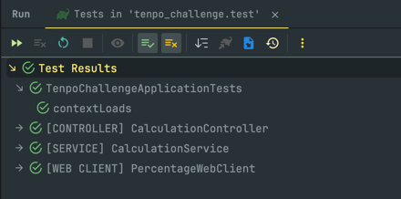

# Tenpo Challenge Backend

[](https://openjdk.java.net/projects/jdk/21/)
[](https://spring.io/projects/spring-boot)
[](https://www.postgresql.org/)
[](https://www.docker.com/)

> **Backend Challenge x Sebastián Kravetz @ Tenpo CL**

Servicio Backend API REST construido en Spring Boot, que expone servicios de cálculo con aplicación de porcentaje adicional. Cuenta con caché para el valor del porcentaje obtenido de servicio externo y registro asíncrono de historial de llamadas. Esto fue desarrollado como parte del desafío técnico de Backend Engineer para Tenpo CL.

## Tabla de Contenidos

- [Arquitectura](#arquitectura)
- [Características Principales](#características-principales)
- [Tecnologías Utilizadas](#tecnologías-utilizadas)
- [Configuración y Ejecución](#configuración-y-ejecución)
- [Variables de Entorno](#variables-de-entorno)
- [Endpoints](#endpoints)
- [Testing](#testing)
- [Documentación API](#documentación)

## Arquitectura

El proyecto está compuesto por **dos microservicios** independientes:

### 1. **ms-calculator** (Puerto 8080)
Servicio principal que maneja:
- Cálculos matemáticos con porcentajes dinámicos
- Sistema de caché (30 minutos TTL)
- Registro asíncrono de historial de llamadas
- Conexión con la base de datos PostgreSQL
- Este servicio fue diseñado con una estructura de proyecto que sigue una arquitectura *CLEAN*, basada en *dominio* (contextos de negocio) y con un *vertical slicing* dentro de cada feature.

### 2. **ms-percentage** (Puerto 8081)
Microservicio que proporciona:
- Porcentajes dinámicos
- Simulación de servicio externo

## Características Principales

### Cálculo con Porcentaje Dinámico
- Recibe dos números (`firstAmount` y `secondAmount`) en formato decimal.
- Los suma y aplica un porcentaje obtenido del servicio externo
- Fórmula: `resultado = (num1 + num2) + ((num1 + num2) * porcentaje)`

### Sistema de Caché con TTL (Time-to-live)
- **TTL configurable**: 30 minutos por defecto
- **Fallback automático**: Si el servicio externo falla, utiliza el último valor cacheado hasta la duración del TTL.
- **Manejo de errores**: Si no hay valor disponible en la caché, retorna error.

### Historial de Llamadas
- **Registro asíncrono**: No afecta el rendimiento de las respuestas
- **Almacenamiento completo**: Fecha, endpoint, parámetros, respuesta exitosa ó error
- **Paginación**: Endpoints con soporte para paginación y ordenamiento
- **HATEOAS**: La paginación también cuenta con links para las páginas previas ó siguientes.
- **Persistencia**: Almacenado en PostgreSQL. Los JSON del payload de entrada así como la 
  respuesta de salida se almacenan en formato JSONB

## Tecnologías Utilizadas

### Backend
- **Java 21** 
- **Spring Boot 3.5.0**
- **Spring Data JPA**
- **Spring Cache (c/ Caffeine)**
- **Spring WebFlux**
- **Spring HATEOAS**

### Base de Datos
- **PostgreSQL 15**
- **Hibernate (ORM)**

### Documentación y Testing
- **SpringDoc OpenAPI 3** - Documentación Swagger
- **JUnit 5** - Testing framework
- **Mockito** - Mocking para tests
- **Testcontainers** - Tests de integración

### DevOps
- **Docker & Docker Compose** - Para containeizar los servicios
- **Gradle** - Gestor de dependencias


## Configuración y Ejecución

### Prerrequisitos
- **Docker CLI ó Docker Desktop** instalado
  - Si corre en una VM cloud, debe instalarse el CLI de Docker Compose por separado.
- **Java 21**
- **Git**

### Ejecución con Docker Compose

1. **Clonar el repositorio**
```bash
git clone <url-del-repositorio>
cd TenpoChallengeBackend
```

2. **Levantar todos los servicios**
```bash
docker compose up -d
# o si quiere forzar el rebuild de los contenedores:
docker compose up --build
# o si utiliza una versión anterior de docker compose:
docker-compose up ...
```

3. **Verificar que los servicios están funcionando**
```bash
# Verificar estado de los contenedores
docker ps

# Ver logs del servicio calculadora
docker compose logs -f ms-calculator

# Ver logs del servicio porcentajes
docker compose logs -f ms-percentage
```

4. **Rutas expuestas**
- **API Calculadora**: http://localhost:8080/api/v1
- **API Porcentajes**: http://localhost:8081/api/v1
- **Swagger UI**: http://localhost:8080/api/v1/swagger-ui/index.html
- **Base de Datos**: localhost:5432

### Detener los servicios
```bash
docker-compose down
```

### Resetear la base de datos
```bash
docker-compose down -v  # elimina el volumen de postgresql
docker-compose up -d
```

## Variables de Entorno

### Configuración del Servicio Calculadora

| Variable | Descripción                                           |
|----------|-------------------------------------------------------|
| `MSCALC_DB_HOST` | Host de PostgreSQL                            |
| `MSCALC_DB_PORT` | Puerto de PostgreSQL                          |
| `MSCALC_DB_NAME` | Nombre de la base de datos                    |
| `MSCALC_DB_USER` | Usuario de la base de datos                   |
| `MSCALC_DB_PASSWORD` | Contraseña de la base de datos            |
| `MSCALC_API_VERSION` | Versión de la API                         |
| `MSCALC_API_CACHE_TTL` | TTL del caché de porcentajes            |
| `MSCALC_WEBSERVICE_PERCENTAGE` | URL del servicio de porcentajes |

### Personalizar Configuración

Para modificar las variables, edita el archivo `docker-compose.yml`:

```yaml
services:
  ms-calculator:
    environment:
      - MSCALC_API_CACHE_TTL=15m    # Cambiar TTL a 15 minutos
      - MSCALC_DB_PASSWORD=otra_contraseña
```

## Endpoints

### Servicio Calculadora

#### `POST /api/v1/calculation/calculate`
Realiza cálculo con porcentaje dinámico adicional.

**Request Body:**
```json
{
  "firstAmount": 1.0,
  "secondAmount": 7.0
}
```

**Ejemplo Response:**
```json
{
  "result": 9.520,
  "percentageApplied": 0.19
}
```

#### `GET /api/v1/history?page=0&size=10&order=DESC`
Obtiene el historial de llamadas con paginación.

**Ejemplo Response:**
```json
{
  "_embedded": {
    "records": [
      {
        "requestId": 11,
        "requestDate": "2025-06-16T20:49:27.034936Z",
        "requestEndpoint": "/calculation/calculate",
        "requestType": "SUCCESS",
        "requestParameters": {
          "firstAmount": 1.0,
          "secondAmount": 7.0
        },
        "responseBody": {
          "result": 9.52,
          "percentageApplied": 0.19
        }
      },,
      ...,
      ...
    ]
  },
  "page": {
    "size": 10,
    "totalElements": 50,
    "totalPages": 5,
    "number": 0
  }
}
```

### Servicio Porcentajes (Puerto 8081)

#### `GET /api/v1/percentage`
Obtiene un porcentaje dinámico.

**Ejemplo Response:**
```json
{
  "percentage": 0.15
}
```

## Testing



### Ejecutar Tests Unitarios
```bash
# Desde el directorio ms_calculator_tenpo
./gradlew test
```

### Tests Implementados
- **CalculationControllerTest**: Tests del controlador principal de cálculos con porcentaje.
- **CalculationServiceTest de integración**: Tests del servicio de cálculos con porcentaje.
- **PercentageWebClientTest**: Tests del cliente HTTP hacia el servicio de porcentajes, con simulación de fallos


## Documentación

### Swagger UI
Una vez que la aplicación está ejecutándose, se puede acceder a la documentación interactiva generada con Swagger UI:

**URL**: http://localhost:8080/api/v1/swagger-ui/index.html

### OpenAPI Spec
- **JSON**: http://localhost:8080/api/v1/api-docs
- **YAML**: http://localhost:8080/api/v1/api-docs.yaml


## Desarrollador
**Desarrollado por**: Sebastián Kravetz  
**Email**: root@sebastiankravetz.dev  
**Website**: https://sebastiankravetz.dev  

**Para TENPO CL**
